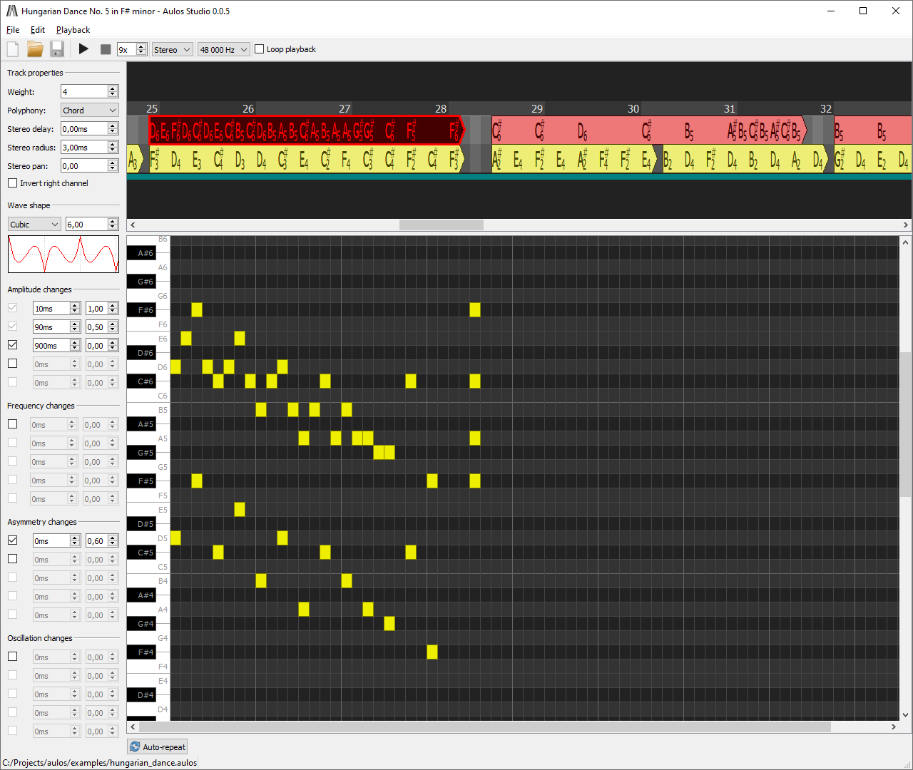

### [Download Aulos Studio 0.0.5 for Windows](https://ci.appveyor.com/api/buildjobs/dnaql7b4su4r2ak8/artifacts/AulosStudio-0.0.5.exe)

[...or get the latest unstable installer at your own risk](https://ci.appveyor.com/api/projects/blagodarin/aulos/artifacts/AulosStudio-0.0.5-unstable.exe?branch=master&job=Environment%3A%20CONFIG%3DRelease%2C%20ARCH%3Damd64%2C%20GENERATOR%3DNinja%2C%20INSTALLER%3DON%2C%20QT%3D5)

# Aulos

Aulos is an audio synthesis toolkit consisting of:
* **Aulos Studio**, a full-featured tool for working with Aulos compositions.
  Aulos Studio provides convenient ways to create, edit, play and export Aulos compositions
  without requiring any experience in making music.
* **aulos** library which provides functionality to convert Aulos compositions into waveform data.
  Aulos compositions are tiny compared to what one would expect from a piece of music,
  yet they can be rendered with any desired quality.

The primary features of Aulos are:
* **Embeddable technology.** The library has no external dependencies (apart from
  the C++ standard library) and can be easily integrated into third-party applications.
* **Fully synthetic sound.** Each Aulos composition is completely self-contained
  and doesn't require additional data (e. g. sound banks) to be rendered.
* **Focus on performance.** All design decision are guided by performance considerations,
  and every change in the synthesis code is benchmarked.
* **Incremental synthesis.** A composition can be rendered block by block,
  which allows to reduce memory requirements and improve load times.

## What does it look like

## What's not there

* **Version compatibility.** Aulos is still at the prototype stage, so until at least 0.1
  *any* commit may change *anything* (API, ABI, file format) in an incompatible way.
* **Binary file format.** Binary data is more compact and should be faster to load.
  However, the composition structure should be stabilized before adding binary format,
  and at this stage of development, some format changes require manual file manipulations,
  which are easier to do with text than with binary data.
* **Visual voice editor.** The current editor lacks visualization of what's going on
  under the hood.
* **Voice libraries.** It's inconvenient to start every composition from scratch,
  reinventing all voices or copying them value-by-value from another composition.
  It's also more user-friendly to provide newcomers with a set of pre-designed
  voices than to force them to make their own.
* **MIDI import.** Not needing to recreate existing melodies in the Studio
  can greatly improve Aulos adoption.
* **Easy sequence manipulation.** Ability to copy, move, split and merge sequences
  from the Studio is also required for switching to binary file format.
